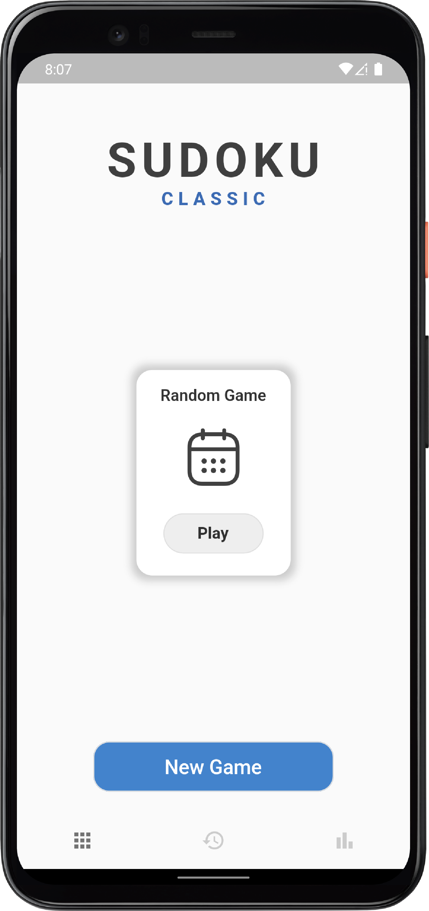
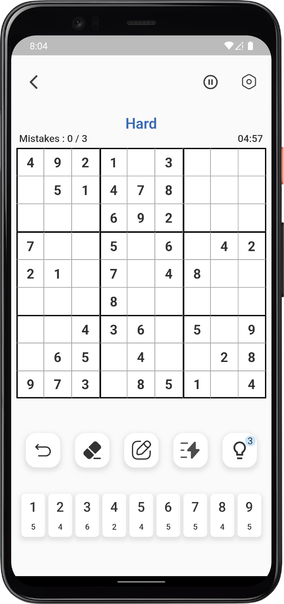
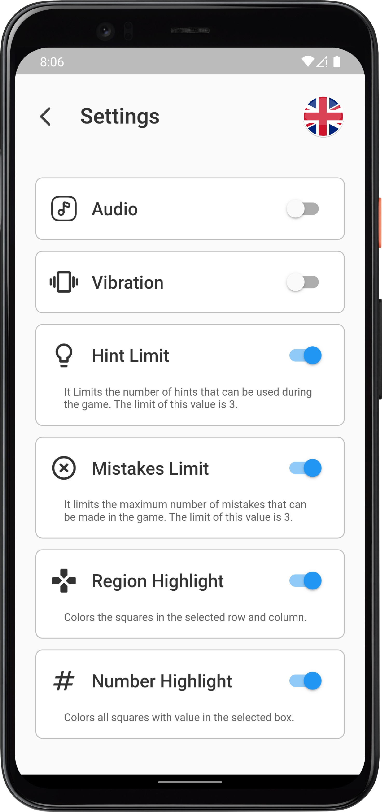

<h1 align="center">
  <br> Classic Sudoku <br>
</h1>

<p align="center">
  
   
  
</p>

## How To Use

You can download the repository or clone it via [Git](https://git-scm.com/downloads)
```bash
# Clone the repository
$ git clone https://github.com/mertozturksh/flutter_sudoku.git

# Go into the repository
$ cd flutter_sudoku

# Install dependencies
$ flutter pub get

# Run the app
$ flutter run
```
